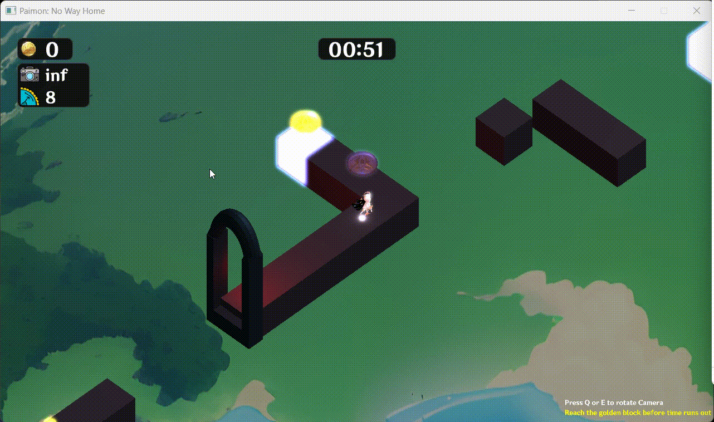
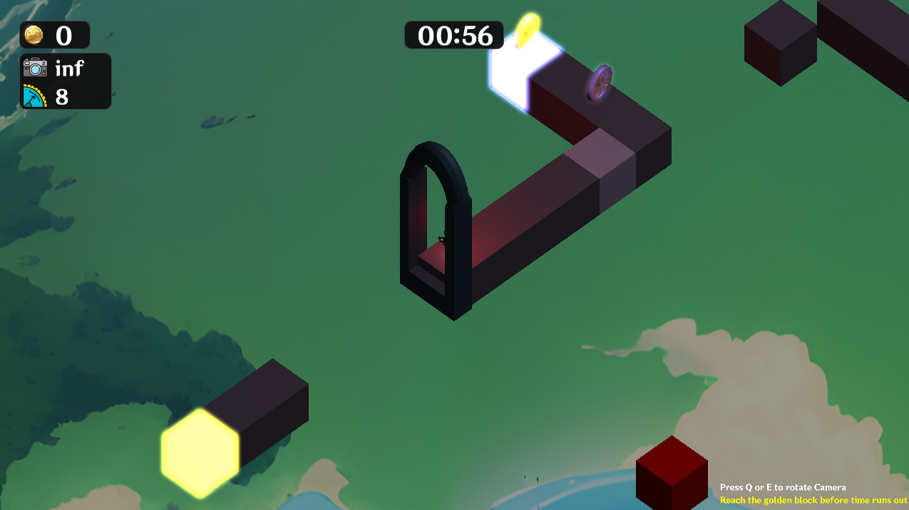
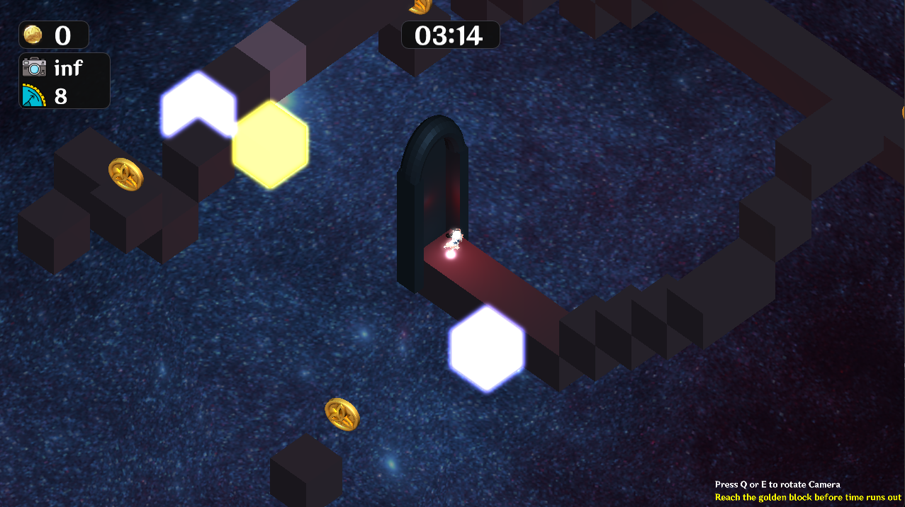
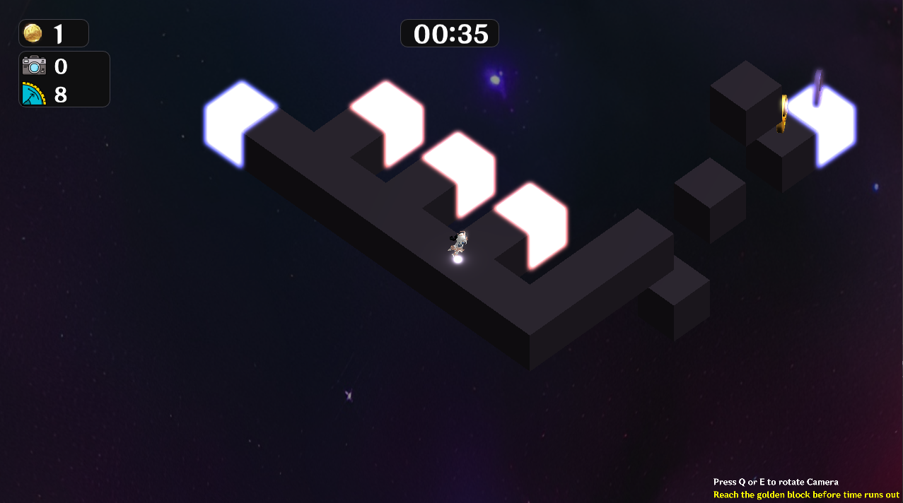
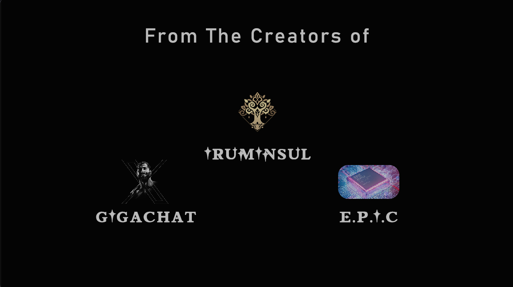
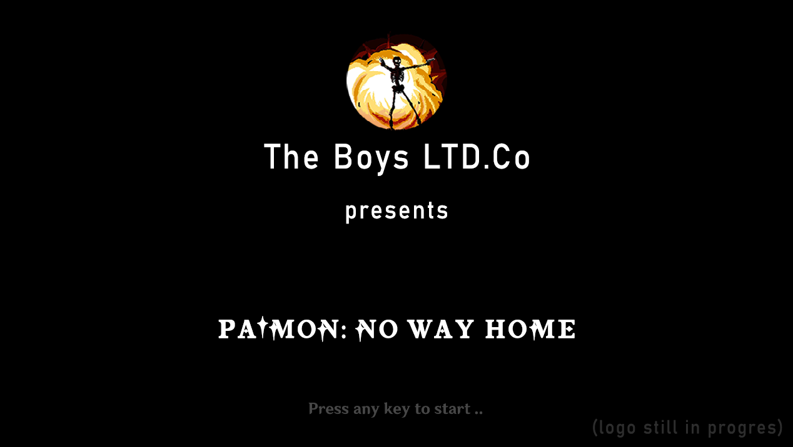

<a name="readme-top"></a>

[![Contributors][contributors-shield]][contributors-url]
[![Forks][forks-shield]][forks-url]
[![Stargazers][stars-shield]][stars-url]
[![Issues][issues-shield]][issues-url]
[![MIT License][license-shield]][license-url]

<!-- PROJECT LOGO -->
<br />
<div align="center">
  <a href="https://github.com/AbdoWise-z/Paimon-No-Way-Home">
    
  </a>

<h3 align="center">Paimon: No Way Home</h3>
  <p align="center">
    An optical 3d puzzle game
    <br />
    <a href="https://github.com/AbdoWise-z/Paimon-No-Way-Home/tree/master/cpu"><strong>Explore</strong></a>
    <br />
    <br />
    <a href="https://github.com/AbdoWise-z/Paimon-No-Way-Home/tree/master/source">Source</a>
    ·
    <a href="https://github.com/AbdoWise-z/Paimon-No-Way-Home/tree/master/images">Images</a>
    ·
    <a href="https://github.com/AbdoWise-z/Paimon-No-Way-Home/issues">Request Feature</a>
  </p>
</div>

<!-- TABLE OF CONTENTS -->
## Table of Contents
<ol>
<li>
    <a href="#about-the-project">About The Project</a>
    <ul>
        <li><a href="#features">Features</a></li>
        <li><a href="#built-with">Built With</a></li>
    </ul>
</li>
    <li><a href="#getting-started">Getting Started</a></li>
    <li><a href="#pre-built-version">Pre-built Version</a></li>
    <li><a href="#images">Images</a></li>
    <li><a href="#contributing">Contributing</a></li>
    <li><a href="#license">License</a></li>
    <li><a href="#contact">Contact</a></li>
</ol>

<!-- ABOUT THE PROJECT -->
## About The Project

We developed this game as a part of our 3rd year 2nd term study in Computer Engineering department at Cairo
University, it was built on top of a game engine (which we also developed), the game features a new type of
3d optical puzzles, where the player pass obstacles by utilizing the different orientations of an orthogonal
camera.

## Features
We included various mechanisms such as:

<table>
<tr>
<td>
<div style="display: flex; align-items: center;flex-direction: column;  justify-content: flex-start; font-size: 18px;">
    <p style="margin: 0;">Collectable items & Hidden paths</p>
    
</div>
</td>
<td>
<div style="display: flex; align-items: center;flex-direction: column;  justify-content: flex-start; font-size: 18px;">
    <p style="margin: 0;">Camera Illusions</p>
    
</div>
</td>
</tr>
<tr>
<td>
<div style="display: flex; align-items: center;flex-direction: column;  justify-content: flex-start; font-size: 18px;">
    <p style="margin: 0;">&nbsp</p>
    <p style="margin: 0;">Moving Platforms</p>
    
</div>
</td>
<td>
<div style="display: flex; align-items: center;flex-direction: column;  justify-content: flex-start; font-size: 18px;">
    <p style="margin: 0;">&nbsp</p>    
    <p style="margin: 0;">Push Buttons</p>
    
</div>
</td>
</tr>
</table>


and more to come ...

<p align="right">(<a href="#readme-top">back to top</a>)</p>

### Built With

This project was purely built using C++/C, we used libraries such as 
* ImGui: For UI Rendering
* irrKlang: as a sound Engine
* Glad
* OpenGL

![C++][language-1-shield]
![OpenGL][language-2-shield]

<p align="right">(<a href="#readme-top">back to top</a>)</p>


<!-- GETTING STARTED -->
## Getting Started
This guide provides step-by-step instructions for setting up and developing on the `Paimon-No-Way-Home` C++ project.

### Prerequisites

Ensure you have the following tools installed on your machine:

- **Git**: Version control system to clone the repository.
- **CMake**: Build system generator.
- **A C++ Compiler**: Such as GCC or Clang.
- **Make**: Build automation tool (if on a Unix-based system).
- **Visual Studio**: (Optional, if on Windows and using Visual Studio as the IDE).

### Steps

1. **Clone the Repository**

   Open your terminal or command prompt and run the following command to clone the repository:

    ```sh
    git clone https://github.com/AbdoWise-z/Paimon-No-Way-Home.git
    ```

   Navigate to the project directory:

    ```sh
    cd Paimon-No-Way-Home
    ```

2. **Create a Build Directory**

   Create a separate directory for building the project to keep the source directory clean:

    ```sh
    mkdir build
    cd build
    ```

3. **Generate Build Files with CMake**

   Run CMake to generate the necessary build files:

    ```sh
    cmake ..
    ```

   If you want to specify a particular generator (e.g., Makefiles, Ninja, Visual Studio), you can do so with the `-G` flag. For example:

    ```sh
    cmake -G "Unix Makefiles" ..
    ```

4. **Build the Project**

   Compile the project using the generated build files. If you used Makefiles, run:

    ```sh
    make
    ```

   For other generators, the command may differ (e.g., `ninja` for Ninja, or opening the `.sln` file in Visual Studio and building from there).

5. **Run the Application**

   After a successful build, you can run the application. The executable should be in the `build` directory:

    ```sh
    ./PaimonNoWayHome
    ```

   If you're using an IDE like Visual Studio, you can run the project directly from the IDE.

6. **Develop and Contribute**

    - Make your changes in the appropriate source files.
    - Follow the project's coding standards and guidelines.
    - Test your changes thoroughly.

7. **Submit a Pull Request**

   Once you have made and tested your changes:

    - Commit your changes:

      ```sh
      git add .
      git commit -m "Description of your changes"
      ```

    - Push your changes to your fork:

      ```sh
      git push origin your-branch-name
      ```

    - Create a pull request on the GitHub repository.

<p align="right">(<a href="#readme-top">back to top</a>)</p>

## Pre Built Version

We can also provide you with a pre-built version of the game, it can be found [here](https://xabdomo.itch.io/paimon-no-way-home)

## Images

<table>
<tr>
   <td>
      
   </td>
   <td>
      
   </td>
</tr>
<tr>
   <td>
      
   </td>
   <td>
      
   </td>
<tr>
   <td>
      
   </td>
</tr>
</table>

<p align="right">(<a href="#readme-top">back to top</a>)</p>

<!-- CONTRIBUTING -->
## Contributing

Contributions are what make the open source community such an amazing place to learn, inspire, and create. Any contributions you make are **greatly appreciated**.

This project was developed by
<table>
<tr>

<td align="center">
<a href="https://github.com/AbdoWise-z" target="_black">
<br /><sub><b>Abdulrahman Mohammed </b></sub> <br/></a>
</td>

<td align="center">
<a href="https://github.com/Elkapeer" target="_black">
<br /><sub><b>Osama Saleh</b></sub><br/></a>
</td>

<td align="center">
<a href="https://github.com/amr-salahuddin" target="_black">
<br /><sub><b>Amr Salahuddin</b></sub><br/></a>
</td>

<td align="center">
<a href="https://github.com/IbraheimTarek" target="_black">
<br /><sub><b>Ibraheim Tarek</b></sub><br/></a>
</td>

</tr>
</table>

If you have a suggestion that would make this better, please fork the repo and create a pull request. You can also simply open an issue with the tag "enhancement".
Don't forget to give the project a star! Thanks again!

1. Fork the Project
2. Create your Feature Branch (`git checkout -b feature/AmazingFeature`)
3. Commit your Changes (`git commit -m 'Add some AmazingFeature'`)
4. Push to the Branch (`git push origin feature/AmazingFeature`)
5. Open a Pull Request

<p align="right">(<a href="#readme-top">back to top</a>)</p>

<!-- LICENSE -->
## License

Distributed under the MIT License. See `LICENSE.txt` for more information.

<p align="right">(<a href="#readme-top">back to top</a>)</p>

<!-- CONTACT -->
## Contact

[Abdulrahman Mohammed Abdulfattah](https://www.linkedin.com/in/abdo-mohamed-5b3506252/) - <moh2002.abdow@gmail.com>

<p align="right">(<a href="#readme-top">back to top</a>)</p>

<!--difiniations -->

[contributors-shield]: https://img.shields.io/github/contributors/AbdoWise-z/the-epic-cpu?style=for-the-badge
[contributors-url]: https://github.com/AbdoWise-z/Paimon-No-Way-Home/graphs/contributors

[forks-shield]: https://img.shields.io/github/forks/AbdoWise-z/the-epic-cpu?style=for-the-badge
[forks-url]: https://github.com/AbdoWise-z/Paimon-No-Way-Home/network/members

[stars-shield]: https://img.shields.io/github/stars/AbdoWise-z/the-epic-cpu?style=for-the-badge
[stars-url]: https://github.com/AbdoWise-z/Paimon-No-Way-Home/stargazers

[issues-shield]: https://img.shields.io/github/issues/AbdoWise-z/the-epic-cpu?style=for-the-badge
[issues-url]: https://github.com/AbdoWise-z/Paimon-No-Way-Home/issues

[license-shield]: https://img.shields.io/github/license/AbdoWise-z/the-epic-cpu?style=for-the-badge
[license-url]: https://github.com/AbdoWise-z/Paimon-No-Way-Home/blob/master/LICENSE.txt


[language-1-shield]: https://img.shields.io/badge/c++-%2300599C.svg?style=for-the-badge&logo=c%2B%2B&logoColor=white
[language-2-shield]: https://img.shields.io/badge/OpenGL-%23FFFFFF.svg?style=for-the-badge&logo=opengl
